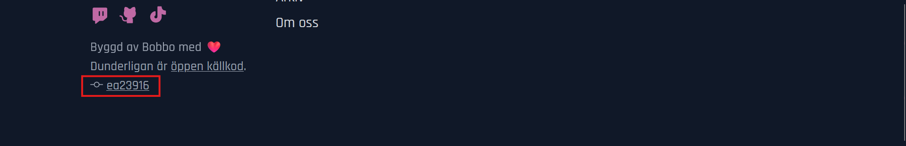

# Deployment

The server and database are hosted on a VPS provided by Linköping University's computer association [Lysator](https://www.lysator.liu.se/). [Coolify](https://coolify.io) is used to automatically deploy changes, configure the reverse proxy (Caddy) and manage Docker containers.

Any pushed changes to the `dev` branch will trigger a redeploy on the [staging site](https://dev.dunderligan.se), while pushes on `master` go straight to [production](https://dunderligan.se). In the footer, the commit hash of the current version is shown:

