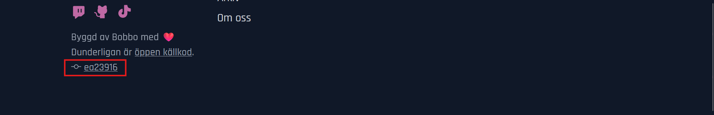

# Deployment

The server and database are hosted on a VPS provided by Linköping University's computer association [Lysator](https://www.lysator.liu.se/). [Coolify](https://coolify.io) is used to automatically deploy changes, configure the reverse proxy (Caddy) and manage Docker containers.

Any pushed changes to the `dev` branch will trigger a redeploy on the [staging site](https://dev.dunderligan.se), while pushes on `master` go straight to [production](https://dunderligan.se). In the footer, the commit hash of the current version is shown:

## Docker

The Dockerfile is only used for deployment, while the Docker Compose file is only used for development. The Dockerfile simply builds and runs the Node binary, while the database and other services (currently Postgres and Redis) are managed externally by Coolify. Compose is on the other hand used to quickly set up local environments with the aformentioned services.
